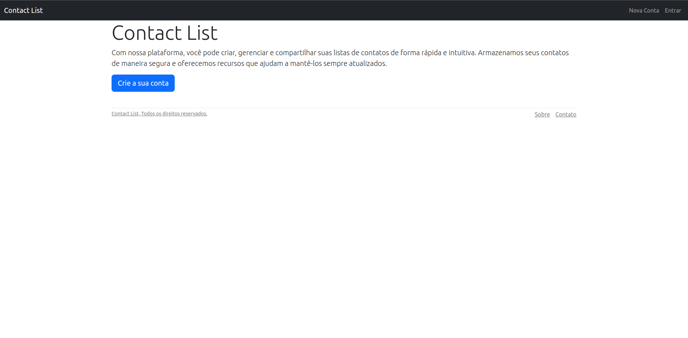

# Lista de Contatos

Esta é uma aplicação web simples de lista de contatos desenvolvida em Ruby on Rails. A aplicação permite criar usuários, adicionar contatos à lista de cada usuário, remover contatos e editar informações dos usuários.

## Requisitos

Certifique-se de ter as seguintes versões instaladas em seu ambiente de desenvolvimento:

- Ruby 3.1.2
- Rails 7.0.6

Além disso, a aplicação utiliza a gem Bootstrap na versão 5.3.0.alpha3.

## Instalação

1. Clone este repositório para o seu ambiente local:

    `git clone git@github.com:PhilipeeX/Contact_list.git`

2. Acesse a pasta do projeto:

    cd lista-de-contatos

3. Instale as dependências do projeto:

    bundle install

4. Execute as migrações do banco de dados:

    rails db:migrate

5. Inicie o servidor de desenvolvimento:

    rails server

6. Acesse a aplicação em seu navegador em `http://localhost:3000`.

## Funcionalidades

A aplicação permite realizar as seguintes ações:

- Criar uma conta de usuário
- Fazer login e logout
- Editar informações do usuário logado
- Adicionar um contato à lista do usuário logado
- Remover um contato da lista do usuário logado
- Editar informações de um contato

## Demonstração

Aqui está um GIF que mostra a aplicação em funcionamento:

## Contribuição

Se você quiser contribuir para este projeto, fique à vontade para abrir uma issue ou enviar um pull request.

## Licença

Este projeto está licenciado sob a [MIT License](LICENSE).
